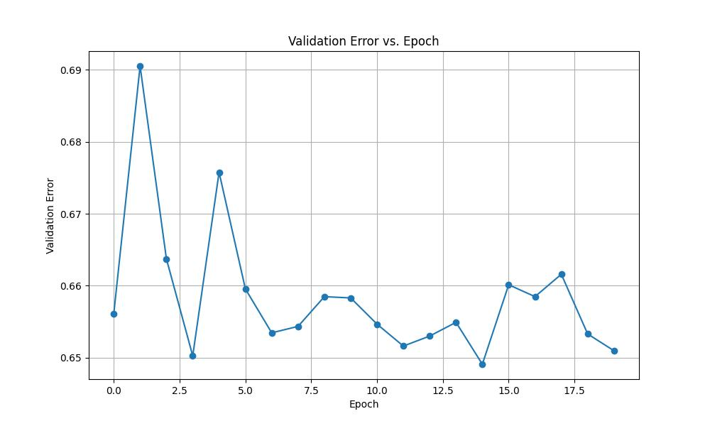

fmri_twins_prediction
==============================

Hello. We are Roland and Sven and this is our MLOps project!<br>

# Project Description

In our Project we intend to work with public data from OpenNeuro (https://openneuro.org/datasets/ds004169)
consisting of MRI scans of 1202 participants. Especially all participants are twins. We therefore want to
predict twin status based on functional/structural brain data. The data consists of MRI scans for each subject
yielding a functional and an anatomical scan in ‘.nii’ format which can be conveniently handled using nilearn
package (https://nilearn.github.io/stable/index.html). The same package could be used in a preprocessing
step for brain parcellation. In the prediction task we intend to work with pytorch geometric since functional
as well as anatomical connections can be interpreted as a graph (each brain region corresponds to a node and
functional/structural connection to an edge).

# Project Organization
------------

    ├── LICENSE
    ├── Makefile           <- Makefile with commands like `make data` or `make train`
    ├── README.md          <- The top-level README for developers using this project.
    ├── data
    │   ├── external       <- Data from third party sources.
    │   ├── interim        <- Intermediate data that has been transformed.
    │   ├── processed      <- The final, canonical data sets for modeling.
    │   └── raw            <- The original, immutable data dump.
    │
    ├── docs               <- A default Sphinx project; see sphinx-doc.org for details
    │
    ├── models             <- Trained and serialized models, model predictions, or model summaries
    │
    ├── notebooks          <- Jupyter notebooks. Naming convention is a number (for ordering),
    │                         the creator's initials, and a short `-` delimited description, e.g.
    │                         `1.0-jqp-initial-data-exploration`.
    │
    ├── references         <- Data dictionaries, manuals, and all other explanatory materials.
    │
    ├── reports            <- Generated analysis as HTML, PDF, LaTeX, etc.
    │   └── figures        <- Generated graphics and figures to be used in reporting
    │
    ├── requirements.txt   <- The requirements file for reproducing the analysis environment, e.g.
    │                         generated with `pip freeze > requirements.txt`
    │
    ├── setup.py           <- makes project pip installable (pip install -e .) so src can be imported
    ├── src                <- Source code for use in this project.
    │   ├── __init__.py    <- Makes src a Python module
    │   │
    │   ├── data           <- Scripts to download or generate data
    │   │   └── make_dataset.py
    │   │
    │   ├── features       <- Scripts to turn raw data into features for modeling
    │   │   └── build_features.py
    │   │
    │   ├── models         <- Scripts to train models and then use trained models to make
    │   │   │                 predictions
    │   │   ├── predict_model.py
    │   │   └── train_model.py
    │   │
    │   └── visualization  <- Scripts to create exploratory and results oriented visualizations
    │       └── visualize.py
    │
    └── tox.ini            <- tox file with settings for running tox; see tox.readthedocs.io


--------
## :wave: Attribution
Project based on the <a target="_blank" href="https://drivendata.github.io/cookiecutter-data-science/">cookiecutter data science project template</a>. #cookiecutterdatascience

---
layout: default
nav_exclude: true
---

# Exam template for 02476 Machine Learning Operations

This is the report template for the exam. Please only remove the text formatted as with three dashes in front and behind
like:

```--- question 1 fill here ---```

where you instead should add your answers. Any other changes may have unwanted consequences when your report is auto
generated in the end of the course. For questions where you are asked to include images, start by adding the image to
the `figures` subfolder (please only use `.png`, `.jpg` or `.jpeg`) and then add the following code in your answer:

```markdown

```

In addition to this markdown file, we also provide the `report.py` script that provides two utility functions:

Running:

```bash
python report.py html
```

will generate an `.html` page of your report. After deadline for answering this template, we will autoscrape
everything in this `reports` folder and then use this utility to generate an `.html` page that will be your serve
as your final handin.

Running

```bash
python report.py check
```

will check your answers in this template against the constrains listed for each question e.g. is your answer too
short, too long, have you included an image when asked to.

For both functions to work it is important that you do not rename anything. The script have two dependencies that can
be installed with `pip install click markdown`.

## Overall project checklist

The checklist is *exhaustic* which means that it includes everything that you could possible do on the project in
relation the curricilum in this course. Therefore, we do not expect at all that you have checked of all boxes at the
end of the project.

### Week 1

* [ ] Create a git repository
* [ ] Make sure that all team members have write access to the github repository
* [ ] Create a dedicated environment for you project to keep track of your packages
* [ ] Create the initial file structure using cookiecutter
* [ ] Fill out the `make_dataset.py` file such that it downloads whatever data you need and
* [ ] Add a model file and a training script and get that running
* [ ] Remember to fill out the `requirements.txt` file with whatever dependencies that you are using
* [ ] Remember to comply with good coding practices (`pep8`) while doing the project
* [ ] Do a bit of code typing and remember to document essential parts of your code
* [ ] Setup version control for your data or part of your data
* [ ] Construct one or multiple docker files for your code
* [ ] Build the docker files locally and make sure they work as intended
* [ ] Write one or multiple configurations files for your experiments
* [ ] Used Hydra to load the configurations and manage your hyperparameters
* [ ] When you have something that works somewhat, remember at some point to to some profiling and see if
      you can optimize your code
* [ ] Use Weights & Biases to log training progress and other important metrics/artifacts in your code. Additionally,
      consider running a hyperparameter optimization sweep.
* [ ] Use Pytorch-lightning (if applicable) to reduce the amount of boilerplate in your code

### Week 2

* [ ] Write unit tests related to the data part of your code
* [ ] Write unit tests related to model construction and or model training
* [ ] Calculate the coverage.
* [ ] Get some continuous integration running on the github repository
* [ ] Create a data storage in GCP Bucket for you data and preferable link this with your data version control setup
* [ ] Create a trigger workflow for automatically building your docker images
* [ ] Get your model training in GCP using either the Engine or Vertex AI
* [ ] Create a FastAPI application that can do inference using your model
* [ ] If applicable, consider deploying the model locally using torchserve
* [ ] Deploy your model in GCP using either Functions or Run as the backend

### Week 3

* [ ] Check how robust your model is towards data drifting
* [ ] Setup monitoring for the system telemetry of your deployed model
* [ ] Setup monitoring for the performance of your deployed model
* [ ] If applicable, play around with distributed data loading
* [ ] If applicable, play around with distributed model training
* [ ] Play around with quantization, compilation and pruning for you trained models to increase inference speed

### Additional

* [ ] Revisit your initial project description. Did the project turn out as you wanted?
* [ ] Make sure all group members have a understanding about all parts of the project
* [ ] Uploaded all your code to github

## Group information

### Question 1
> **Enter the group number you signed up on <learn.inside.dtu.dk>**
>
> Answer:

--- Sven and Roland ---

### Question 2
> **Enter the study number for each member in the group**
>
> Example:
>
> *sXXXXXX, sXXXXXX, sXXXXXX*
>
> Answer:

--- question 2 fill here ---

### Question 3
> **What framework did you choose to work with and did it help you complete the project?**
>
> Answer length: 100-200 words.
>
> Example:
> *We used the third-party framework ... in our project. We used functionality ... and functionality ... from the*
> *package to do ... and ... in our project*.
>
> Answer:

--- We chose to work with PyTorch geometric for managing graph data and PyTorch Lightning to simplify our training process. PyTorch geometric made it easier for us to work with graph data of fmri scans of twins, saving us a lot of time and effort. We also went with PyTorch Geometric because it has special neural networks just for graphs. We chose PyTorch Lightning for training because its easy to use and flexible. It has built-in tools for saving progress, training on multiple devices, and tracking results, which made our work smoother.  Both libraries are also well established in the community. 

  ---

## Coding environment

> In the following section we are interested in learning more about you local development environment.

### Question 4

> **Explain how you managed dependencies in your project? Explain the process a new team member would have to go**
> **through to get an exact copy of your environment.**
>
> Answer length: 100-200 words
>
> Example:
> *We used ... for managing our dependencies. The list of dependencies was auto-generated using ... . To get a*
> *complete copy of our development environment, one would have to run the following commands*
>
> Answer:

--- We tried to separate the overall structure in different tasks/concerns: the data for example should be separated from actual code in a dedicated folder. Similar tests sould be separated from data and other concers in a dedicated test folder. This idea can be applied to each folder itself: for example, the source folder is split into different parts: a folder which contains only scripts containing the modelling part as well as a dedicated folder for e.g. data preprocessing. To start, a new team member would first create a virtual environment. Inside of the environment one would install the reuqired packages (for example via the command line: 'pip install -r requirements.txt'). Then, the necessary data can be downloaded via make download. ---

### Question 5

> **We expect that you initialized your project using the cookiecutter template. Explain the overall structure of your**
> **code. Did you fill out every folder or only a subset?**
>
> Answer length: 100-200 words
>
> Example:
> *From the cookiecutter template we have filled out the ... , ... and ... folder. We have removed the ... folder*
> *because we did not use any ... in our project. We have added an ... folder that contains ... for running our*
> *experiments.*
> Answer:

--- The idea is to split up the project into separate components: scripts in the source folder, data in the data folder and tests in the tests folder.  We did not fill out every folder, e.g. we did not create notebooks or docs. In addition, we have a configs folder which stores configurations for the preprocessing and the training. The template could easily be extended for further use cases.  ---

### Question 6

> **Did you implement any rules for code quality and format? Additionally, explain with your own words why these**
> **concepts matters in larger projects.**
>
> Answer length: 50-100 words.
>
> Answer:

--- Yes, we implemented several rules via github-actions and (locally) via a pre-commit-hook. Especially, we test code style via flake8, static typing via mypy as well as proper documentation for functions and modules. For our tests we used tox wich creates separate environments for each test to separate the testing environment to a certain extent from the local one. We also tested for compatability with other python versions (3.10 and 3.11).These checks are important since it first simplifies the collaboration (each member can expect the code of others to adhere to a certain structure) and second because those test help to trust other contributor's code (especially unit tests and doc tests). ---

## Version control

> In the following section we are interested in how version control was used in your project during development to
> corporate and increase the quality of your code.

### Question 7

> **How many tests did you implement and what are they testing in your code?**
>
> Answer length: 50-100 words.
>
> Example:
> *In total we have implemented X tests. Primarily we are testing ... and ... as these the most critical parts of our*
> *application but also ... .*
>
> Answer:

--- see question 6 ---

### Question 8

> **What is the total code coverage (in percentage) of your code? If you code had an code coverage of 100% (or close**
> **to), would you still trust it to be error free? Explain you reasoning.**
>
> Answer length: 100-200 words.
>
> Example:
> *The total code coverage of code is X%, which includes all our source code. We are far from 100% coverage of our **
> *code and even if we were then...*
>
> Answer:

--- question 8 fill here ---

### Question 9

> **Did you workflow include using branches and pull requests? If yes, explain how. If not, explain how branches and**
> **pull request can help improve version control.**
>
> Answer length: 100-200 words.
>
> Example:
> *We made use of both branches and PRs in our project. In our group, each member had an branch that they worked on in*
> *addition to the main branch. To merge code we ...*
>
> Answer:

--- Yes, we created separate branches for each task. For example, we have a branch called create_first_model where we created out graph neural network with pytorch geometric as well as putting out model in a torch-lighting trainer. Another branch called github-action for example was used to set up the tests and pre commit hooks and so on. In total we tried to work with different branches to support independent working of each member and to have a controlled way of merging into master via pull requests. The pull requests were constructed in such a way, that a code review as well as positive tests were necessary to merge into the master branch in order to guarantee quality. Also, we generally created issues for the resulting pull requests. ---

### Question 10

> **Did you use DVC for managing data in your project? If yes, then how did it improve your project to have version**
> **control of your data. If no, explain a case where it would be beneficial to have version control of your data.**
>
> Answer length: 100-200 words.
>
> Example:
> *We did make use of DVC in the following way: ... . In the end it helped us in ... for controlling ... part of our*
> *pipeline*
>
> Answer:

--- We did not use DVC for managing data in our project. The problem was that we did not have access to a large remote storage space. However, a dvc versioning might have been beneficial for us as we had a long preprocessing pipeline with large storge requirements. Thus, to keep track of changes to the data, data versioning systems like dvc might have been beneficial. We could then load the data to a data storage space and link to this data from a metafile stored in the code repository.  ---

### Question 11

> **Discuss you continues integration setup. What kind of CI are you running (unittesting, linting, etc.)? Do you test**
> **multiple operating systems, python version etc. Do you make use of caching? Feel free to insert a link to one of**
> **your github actions workflow.**
>
> Answer length: 200-300 words.
>
> Example:
> *We have organized our CI into 3 separate files: one for doing ..., one for running ... testing and one for running*
> *... . In particular for our ..., we used ... .An example of a triggered workflow can be seen here: <weblink>*
>
> Answer:

--- Our continuos integration workflow comprised github workflow files and actions. Every time a contributor pushes to a branch, tests are executed (see question 6) via the tox test automation tool. These comprise unit tests, tests for proper formatting and documentation. Also, to merge the contributorś changes with the main branch, a pull request has to be opened and approved by the other team member. The tests test multiple versions of python but only one operating system version (ubuntu latest).  ---

## Running code and tracking experiments

> In the following section we are interested in learning more about the experimental setup for running your code and
> especially the reproducibility of your experiments.

### Question 12

> **How did you configure experiments? Did you make use of config files? Explain with coding examples of how you would**
> **run a experiment.**
>
> Answer length: 50-100 words.
>
> Example:
> *We used a simple argparser, that worked in the following way: python my_script.py --lr 1e-3 --batch_size 25*
>
> Answer:

--- For configuration we used hydra. We have a configuration file for training and preprocessing of our data.
Hydra reads in our configuration as a dictionary where the actual configurations are the values and the keys correspond to the 'placeholder' in our script. For example the statement 'config = OmegaConf.load("configs/data_training.yaml")' uses hydra to instantiate the yaml file as a dictionary where the necessary parameters can be accessed. The user would therefore only write those parameters in the config file but it is important to note that the dictionay keys stated in the yaml must be the same as in the actual code. For example, it should be written: 'conf_epochs = config.epochs'.This approach helps to sepreate arbitrary parameters used in the code from the actual code itself. ---

### Question 13

> **Reproducibility of experiments are important. Related to the last question, how did you secure that no information**
> **is lost when running experiments and that your experiments are reproducible?**
>
> Answer length: 100-200 words.
>
> Example:
> *We made use of config files. Whenever an experiment is run the following happens: ... . To reproduce an experiment*
> *one would have to do ...*
>
> Answer:

--- We did not use any kind of nondeterministic code, so that our experiments are reproducible. Each preprocessing step (downloading, creating the connectivity matrix, etc. is reproducible). Also the data loading is reproducible, as the twin pairs are processed from the participants.tsv file in a reproducible manner. Our data loading for the training process works in such a way that twins are - deterministically - matched with non-twins to generate negative pairs besides the positive pairs given. Thus, replicating our processes should lead to identical results (given the same popultion data).  ---

### Question 14

> **Upload 1 to 3 screenshots that show the experiments that you have done in W&B (or another experiment tracking**
> **service of your choice). This may include loss graphs, logged images, hyperparameter sweeps etc. You can take**
> **inspiration from [this figure](figures/wandb.png). Explain what metrics you are tracking and why they are**
> **important.**
>
> Answer length: 200-300 words + 1 to 3 screenshots.
>
> Example:
> *As seen in the first image when have tracked ... and ... which both inform us about ... in our experiments.*
> *As seen in the second image we are also tracking ... and ...*
>
> Answer:

--- See 'assets/validation_loss.jpg': () . This file was created via a function in src/models/utils and used the logged metrics mentioned in Q13. Typically the optimal model is chosen not from test error but from validation error. The optimal model therefore corresponds to the model with minimal validation loss. Further for accessing model quality we would typically expect for the validation error to go down and potentially later increase again, a situation refrred to as overfitting. ---

### Question 15

> **Docker is an important tool for creating containerized applications. Explain how you used docker in your**
> **experiments? Include how you would run your docker images and include a link to one of your docker files.**
>
> Answer length: 100-200 words.
>
> Example:
> *For our project we developed several images: one for training, inference and deployment. For example to run the*
> *training docker image: `docker run trainer:latest lr=1e-3 batch_size=64`. Link to docker file: <weblink>*
>
> Answer:

--- 

We created a Dockerfile for our project and named it 'trainer.dockerfile'. From this, we built an image using the command `docker build -t twins_training_image:latest -f trainer.dockerfile .`. We then ran a container for training using `docker run twins_training_image`, but without GPU support since we didn't have access to the cloud. The Dockerfile, located in the root directory, sets up the required packages, copies essential data, and initiates the Python script for training.
 ---

### Question 16

> **When running into bugs while trying to run your experiments, how did you perform debugging? Additionally, did you**
> **try to profile your code or do you think it is already perfect?**
>
> Answer length: 100-200 words.
>
> Example:
> *Debugging method was dependent on group member. Some just used ... and others used ... . We did a single profiling*
> *run of our main code at some point that showed ...*
>
> Answer:

--- Since we used VS Code we could use the debugger implemented in VScode. The typical precedure would be to set a so called 'breakpoint' (or multiple) to start the debugger. The debugger would excecute all code up until the first breakpoint is encounterd and enters debugger mode. In debugger mode we can check the actual values of relevant variables, submit commands that are excecuted in the debugger environment and walk through our code step by step in order to track the behavior of our code. Pytorchlighting provided a convenient way to profile our code. The output gets written to stdout after model training. So far, we have not analyzed the profiling output in detail. Regarding debugging, we also followed the advise from the course, e.g. we started with a simple model and created visualizations to track the training process. ---

## Working in the cloud

> In the following section we would like to know more about your experience when developing in the cloud.

### Question 17

> **List all the GCP services that you made use of in your project and shortly explain what each service does?**
>
> Answer length: 50-200 words.
>
> Example:
> *We used the following two services: Engine and Bucket. Engine is used for... and Bucket is used for...*
>
> Answer:

--- question 17 fill here ---

### Question 18

> **The backbone of GCP is the Compute engine. Explained how you made use of this service and what type of VMs**
> **you used?**
>
> Answer length: 100-200 words.
>
> Example:
> *We used the compute engine to run our ... . We used instances with the following hardware: ... and we started the*
> *using a custom container: ...*
>
> Answer:

--- We did not have access to GCP (or AWS or Azure) so that the following questions do not apply to our project  ---

### Question 19

> **Insert 1-2 images of your GCP bucket, such that we can see what data you have stored in it.**
> **You can take inspiration from [this figure](figures/bucket.png).**
>
> Answer:

--- question 19 fill here ---

### Question 20

> **Upload one image of your GCP container registry, such that we can see the different images that you have stored.**
> **You can take inspiration from [this figure](figures/registry.png).**
>
> Answer:

--- question 20 fill here ---

### Question 21

> **Upload one image of your GCP cloud build history, so we can see the history of the images that have been build in**
> **your project. You can take inspiration from [this figure](figures/build.png).**
>
> Answer:

--- question 21 fill here ---

### Question 22

> **Did you manage to deploy your model, either in locally or cloud? If not, describe why. If yes, describe how and**
> **preferably how you invoke your deployed service?**
>
> Answer length: 100-200 words.
>
> Example:
> *For deployment we wrapped our model into application using ... . We first tried locally serving the model, which*
> *worked. Afterwards we deployed it in the cloud, using ... . To invoke the service an user would call*
> *`curl -X POST -F "file=@file.json"<weburl>`*
>
> Answer:

--- We only managed to draw inference from a saved model checkpoint (see )models/predict_model.py). We attempted to use Torchserve to deploy the model locally, but probably due to difficulties with the complex graph structure in pytorch geometric we could not get the .mar file to respond to (curl) calls  ---

### Question 23

> **Did you manage to implement monitoring of your deployed model? If yes, explain how it works. If not, explain how**
> **monitoring would help the longevity of your application.**
>
> Answer length: 100-200 words.
>
> Example:
> *We did not manage to implement monitoring. We would like to have monitoring implemented such that over time we could*
> *measure ... and ... that would inform us about this ... behaviour of our application.*
>
> Answer:

--- Yes, we implemented monitoring for our deployed model using the Evidently framework. This helped us monitor potential data drifts. We manipulated a parameter during training, named factor_of_non_twins, to produce datasets with varied data distributions. Evidently then analyzed if the target distributions remained consistent or changed. Additionally, Evidently generates an HTML report to provide a detailed overview of the monitoring results. Monitoring ensures the model's performance remains consistent over time and alerts us to any necessary updates or recalibrations. ---

### Question 24

> **How many credits did you end up using during the project and what service was most expensive?**
>
> Answer length: 25-100 words.
>
> Example:
> *Group member 1 used ..., Group member 2 used ..., in total ... credits was spend during development. The service*
> *costing the most was ... due to ...*
>
> Answer:

--- none ---

## Overall discussion of project

> In the following section we would like you to think about the general structure of your project.

### Question 25

> **Include a figure that describes the overall architecture of your system and what services that you make use of.**
> **You can take inspiration from [this figure](figures/overview.png). Additionally in your own words, explain the**
> **overall steps in figure.**
>
> Answer length: 200-400 words
>
> Example:
>
> *The starting point of the diagram is our local setup, where we integrated ... and ... and ... into our code.*
> *Whenever we commit code and puch to github, it auto triggers ... and ... . From there the diagram shows ...*
>
> Answer:

--- question 25 fill here ---

### Question 26

> **Discuss the overall struggles of the project. Where did you spend most time and what did you do to overcome these**
> **challenges?**
>
> Answer length: 200-400 words.
>
> Example:
> *The biggest challenges in the project was using ... tool to do ... . The reason for this was ...*
>
> Answer:

--- The biggest challenge in our project was that we used mri data which arguebly are  not the typical case in ML projects. Therefore, we first had to handle mri files and transform those into matrices. Another challenge was that we had to implement our own models from scratch since for graph classification in this context no models are available e.g. on huggingface_hub either for use or for inspiration. Related to this was the other challenge that we had to process connectivity matrices for each patients that we needed to combine into a block matrix for (potentially) each pair of subjects and therefore had yet another 'matrix-pair' with corresponding label twin or no twin. We spent a lot of time in preprocessing since mri files are rather big. Additionaly we needed a proper parcellation of brain into connected areas where we wanted to use nilearn funcitonalities which requires more domain knowledge than we expected (parcellations are typically done via using parcellation atlases but these need to fit to the mri images). After this difficult preprocessing, the data loading and training was also challenging, as our inputs (two graphs of twins) were not in a usual text or image format. Only the binary labels (twin yes no) were standard. Also, creating docker images and containers was difficult as we suffered from lack of storage space and did not have a cloud computing environment. Furthermore, it took a long time to build the images which led to long development cycles.  ---

### Question 27

> **State the individual contributions of each team member. This is required information from DTU, because we need to**
> **make sure all members contributed actively to the project**
>
> Answer length: 50-200 words.
>
> Example:
> *Student sXXXXXX was in charge of developing of setting up the initial cookie cutter project and developing of the*
> *docker containers for training our applications.*
> *Student sXXXXXX was in charge of training our models in the cloud and deploying them afterwards.*
> *All members contributed to code by...*
>
> Answer:

--- We contributed roughly equally to the project and helped each other to achieve suiteable prototype project. ---
